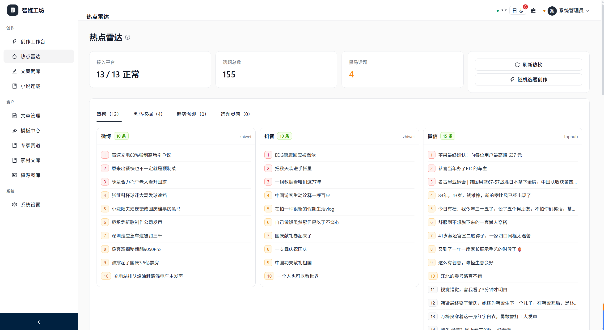
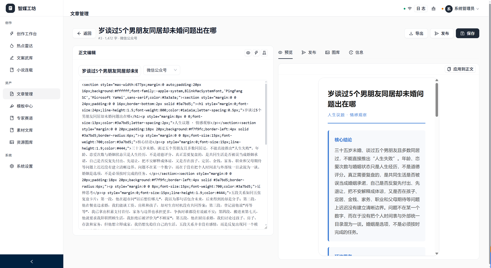
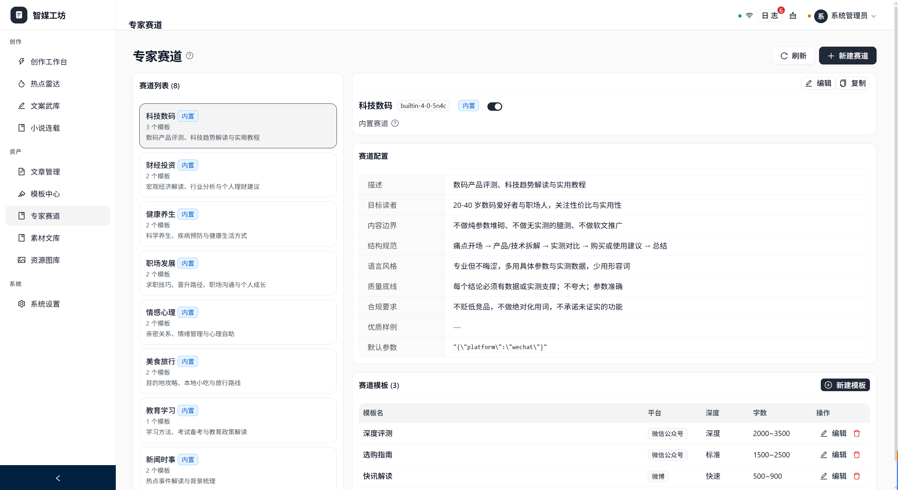
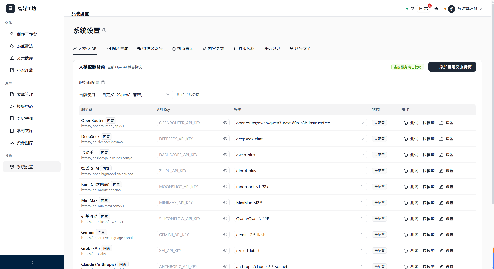

# 智媒工坊（AI 自媒体内容创作平台）

[English](README.en.md)

一站式 AI 自媒体内容创作工具：**热点洞察 → 选题创作 → 专家赛道 → 模型配置**，本地 SQLite 开箱即用，也可桌面端或 Docker 一键部署。

## 界面预览

热点雷达：追踪热门话题，辅助选题与切入角度。



创作工作台：从选题到成稿的一站式写作与编排。



专家赛道：按垂类赛道沉淀人设、风格与创作约束。



模型配置：在系统设置中管理多模型 Provider 与密钥。



## 架构

```
shared/   前后端共享类型与工具（@smg/shared）
server/   Express + SQLite（better-sqlite3）+ WebSocket
web/      React 18 + Vite + Ant Design
desktop/  Electron 桌面端（本地一体化 / 远程双模式）
docs/     设计文档与实现方案
```

## 快速开始

```bash
npm install
npm run setup    # 安装依赖并初始化种子数据（可按需）
npm run dev
```

默认开发：

- 前端 Vite：http://localhost:5173
- 后端 API：http://localhost:5178（同时可托管已构建的 `web/dist`）

生产式单端口（先构建再启动）：

```bash
npm run build
npm start
# 浏览器打开 http://localhost:5178/
```

默认管理员账号：`admin` / `admin123`（可在「系统设置 → 账号安全」修改）。

> 未配置 LLM Key 时，可开启模拟模式做界面演示。

## 数据库

默认使用内嵌 **SQLite**，首次启动自动创建数据目录、表结构与种子数据，无需额外安装。

| 配置 | 说明 |
|------|------|
| `SMG_DATA_DIR` | 数据根目录（含 `smg.db`、uploads、images 等） |
| `PORT` / `HOST` | 服务端口与监听地址（默认 `5178` / `127.0.0.1`） |

桌面端本地模式固定 SQLite，数据位于用户目录（见 [`desktop/README.md`](desktop/README.md)）。

## Docker 部署

```bash
docker compose up -d
```

浏览器打开 **http://localhost:5178/**。数据持久化在命名卷 `smg_data`。

也可直接使用 GHCR 镜像（发版后）：

```bash
docker pull ghcr.io/<owner>/self-media-generation:latest
```

## 桌面端

无需部署、无需装数据库，安装即用：

```bash
npm run desktop:install    # 安装 electron / electron-builder
npm run desktop:prepare    # 构建 server/web 并暂存运行时
npm run desktop:dev        # 本地启动桌面端

npm run desktop:dist       # 打包当前平台安装包 → desktop/release/
```

- **本地模式（默认）**：复用 Electron 内置 Node 启动后端，SQLite 落在用户目录，前端由后端托管。
- **远程模式**：菜单「模式 → 设置远程控制台地址…」。
- 详见 [`desktop/README.md`](desktop/README.md)。

## 自动发布（GitHub Actions）

推送 **main / master**（或手动 Run workflow）即自动升版本号并发布。

```bash
git push origin main
# 或：Actions → Release → Run workflow
```

日常 CI（`.github/workflows/ci.yml`）在 push / PR 时执行 `npm run typecheck` 与 `npm run build`。

## 主要功能

| 模块 | 说明 |
|------|------|
| 创作工作台 | 选题、大纲、正文与配图编排 |
| 热点雷达 | 热点抓取与选题辅助 |
| 文案武库 / 小说连载 | 文案素材与连载写作 |
| 专家赛道 | 垂类人设与风格约束 |
| 模板中心 / 素材文库 / 资源图库 | 模板与媒体资源管理 |
| 系统设置 | 模型 Provider、账号安全等 |

## 许可

内部使用。
